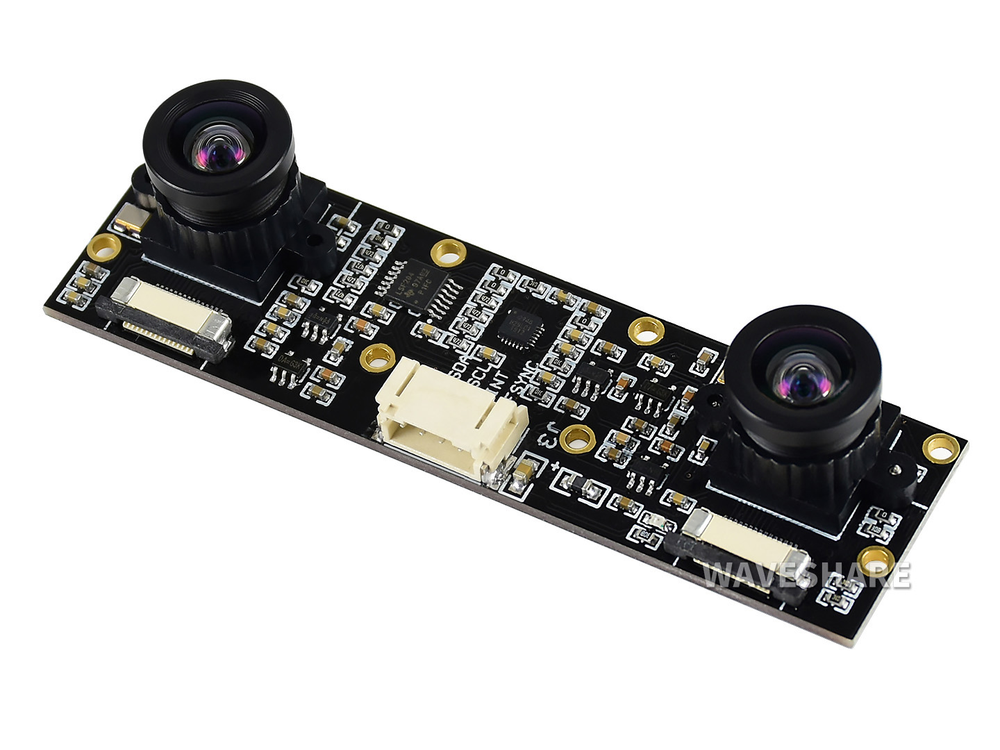

# 功能介绍

对已适配的MIPI接口双目摄像头进行配置，并将采集的图像数据保存到本地，同时以ROS标准图像消息进行发布，供需要使用图像数据的其他模块订阅。

# 物料清单

当前已支持以下MIPI摄像头

| 序号 | 名称   | 示意图片                    | 参数     | 参考链接                                                     |
| ---- | ------ | --------------------------- | -------- | ------------------------------------------------------------ |
| 1    | IMX219 |  | 800W像素 | [IMX219](https://www.waveshare.net/shop/IMX219-83-Stereo-Camera.htm) |


# 使用方法

## 硬件连接

IMX219双目摄像头与RDK X3 Module连接方式如下图：

  

两个摄像头的mipi线分别接到载板的CAM0/CAM1/CAM2的任意两个插槽。

串口线连接到载板的40pin，其中黄色线插到SDA插槽，深蓝色插到SCL插槽。

## 编译

下载源码后，在RDK系统的终端中运行如下指令编译：

```shell
source /opt/tros/setup.bash
colcon build
```

## 启动相机

在RDK系统的终端中运行如下指令，可使用默认相机配置：

```bash
# 配置 tros.b 环境：
source /opt/tros/setup.bash
source install/local_setup.bash
# launch 方式启动
ros2 launch hobot_stereo_mipi_cam stereo_mipi_cam.launch.py
```
stereo_mipi_cam.launch.py配置默认输出左右视图拼接后的3840x1080分辨率jpeg图像，发布的话题名称为/image_raw/compressed。

## 图像可视化

### 使用ROS rqt_image_view

这里采用rqt_image_view方式实现图像可视化，需要在PC端安装ROS2 Foxy或者Humble版本。

保证PC与RDK X3处于同一网段，以Foxy版本为例在PC上执行

```shell
# 配置ROS2环境
source /opt/ros/foxy/local_setup.bash
ros2 run rqt_image_view rqt_image_view
```

选择话题/image_raw/compressed,图像效果如下：


### 使用foxglove可视化

这里采用方式实现图像可视化，需要在RDK上安装rosbridge-suite。

安装命令：

```bash
apt install ros-foxy-rosbridge-suite
```

启动命令：

```bash
# 配置 tros.b 环境：
source /opt/tros/setup.bash
ros2 launch rosbridge_server rosbridge_websocket_launch.xml
```

选择话题/image_raw/compressed，图像效果如下：


## 数据采集

支持自动采集图像数据，并将采集的图像数据保存到本地。

图片保存在运行路径下的`cam_[index]`路径，其中index为相机编号。例如两个mipi线分别接在载板的CAM0和CAM2插槽，则保存路径为`cam_0`和`cam_2`。

在RDK系统的终端中运行如下指令，启动数据采集，每30ms采集一组数据：

```bash
# 配置 tros.b 环境：
source /opt/tros/setup.bash
source install/local_setup.bash
# launch 方式启动
ros2 launch hobot_stereo_mipi_cam stereo_mipi_cam.launch.py data_sampling_ms_diff:=30
```

启动成功后终端输出如下：

```shell
[stereo_mipi_cam-1] 2024/02/02 12:16:09.009 !INFO [x3_cam_init_param][0099]Enable mipi host0 mclk
[stereo_mipi_cam-1] 2024/02/02 12:16:09.009 !INFO [x3_cam_init_param][0099]Enable mipi host1 mclk
[stereo_mipi_cam-1] [WARN] [1706847369.186683712] [MipiStereoCap]: video_index: 2 sp_open_camera_v2 success
[stereo_mipi_cam-1] [WARN] [1706847369.246633338] [mipi_stereo_cam_node]: Dump data collecting file: ./cam_0/0000000.jpg
[stereo_mipi_cam-1] [WARN] [1706847369.491463484] [mipi_stereo_cam_node]: Dump data collecting file: ./cam_2/0000000.jpg
[stereo_mipi_cam-1] [WARN] [1706847370.180848474] [mipi_stereo_cam_node]: Dump data collecting file: ./cam_0/0000001.jpg
[stereo_mipi_cam-1] [WARN] [1706847370.398939833] [mipi_stereo_cam_node]: Dump data collecting file: ./cam_2/0000001.jpg
[stereo_mipi_cam-1] [WARN] [1706847371.007720475] [mipi_stereo_cam_node]: Dump data collecting file: ./cam_0/0000002.jpg
[stereo_mipi_cam-1] [WARN] [1706847371.220861896] [mipi_stereo_cam_node]: Dump data collecting file: ./cam_2/0000002.jpg

```

在启动路径下查看采集到的图片：

```bash
# ls cam_*
cam_0:
0000001.jpg  0000002.jpg  0000003.jpg  0000004.jpg  0000005.jpg

cam_2:
0000001.jpg  0000002.jpg  0000003.jpg  0000004.jpg  0000005.jpg
```

# 接口说明

## 话题

### 发布话题

| 名称         | 消息类型                             | 说明                                     |
| ------------ | ------------------------------------ | ---------------------------------------- |
| /image_raw/compressed   | sensor_msgs::msg::CompressedImage          | 周期发布的图像话题，jpeg格式             |

## 参数

| 名称                         | 参数值                                          | 说明                                               |
| ---------------------------- | ----------------------------------------------- | -------------------------------------------------- |
| image_width                  | 1920（默认）                                    | 和使用的相机有关                                   |
| image_height                 | 1080（默认）                                    | 和使用的相机有关                                   |
| data_sampling_ms_diff         | -1（默认）                      | 采集图像数据的时间间隔，单位ms，<=0表示不采集数据，>0表示每data_sampling_ms_diff ms时间采集一组图像数据 |


# 常见问题

1. 如何设置相机的video_device参数

  相机连接到的载板插槽不同，对应的video_device参数不同，在`include/mipi_stereo_cam_node.h`文件的`std::vector<int> video_index_ {0, 2}`配置中进行设置，默认连接的是CAM0和CAM2两个插槽。

2. 如何使用相机发布的双目数据

  从相机采集到的是经过时间戳对齐后的左右视图的nv12格式图片，在`void OnRecvedImg(std::vector<std::shared_ptr<MipiStereoCamImg>> imgs)`接口中先将两张图片数据编码成jpeg格式，如果启用了数据采集，将这两张图片数据保存到本地，再将两张jpeg图片横向拼接起来后发布。

  需要注意，左右视图的jpeg图片的拼接和发布处理过程比较耗时，如果使用图片数据做算法感知，建议拿到nv12格式图片后只做算法推理，不进行jpeg格式图片的拼接和发布。
